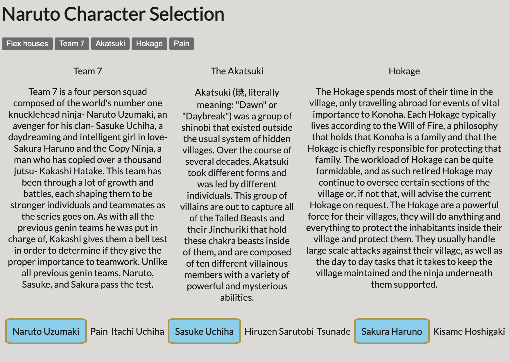

# Naruto Character Selection

In this exercise you will be creating functions that will manipulate the style and the text of this HTML page. Use the information that you have learned from Period 1 and 2 to complete this assignment.

NOTE: the goal for this exercise is to ONLY create & edit JavaScript. Leave the HTML and CSS files alone.

## Directions

- Create a function called `addTitle()`, which will find the `h1` element and add the following text inside of it: "Naruto Character Selection".

- Create a function called `flexIt()`, which should find the first element with the class called `needFlex` and add the class `flexIt` to that element and then toggle the `flexIt` class on and off each time that function is called by the user clicking the button that says "Flex houses".

- Create a function called `addGroups()`, which will find all the paragraphs that have a class called `description` and will set another class name. The new class name should be the name of the corresponding group the text is describing. Example: If the paragraph is about the Akatsuki, find that paragraph and set the class attribute to include "akatsuki" as the 2nd class.

  - Two other classes you want to have are: "team 7" and "hokage".

- Create a function called `emphasize()` with one parameter called group. When the user clicks the button labeled with one of the groups of characters in Naruto, your function applies the CSS styling associated with the `.emphasis` class to both the paragraph that describes that group and the people listed below that belong to that group. Example: When you have the HTML file open in the browser, if the user clicks the Team 7 button at the top, the description of the group and the people from the list at the bottom will all have blue backgrounds and yellow borders around them. When the user clicks that same button again, the styling should disappear.

Bonus: Create a new function called `hideThePain()` that makes the word "Pain" appear and disappear. To do this, you can adjust the element's display attribute to be either "none" or not.

## Mockup

## Submission

Push your code to your Github account and then paste the link to the repo when submitting.

### Assignment Hints

- `document.getElementsByClassName()` puts elements with the specific class into an array.
- `document.querySelectorAll()` returns an array of all matches
- `toggle()` gives you the ability to turn things off and on

Push your code to GitHub and submit the URL below!
